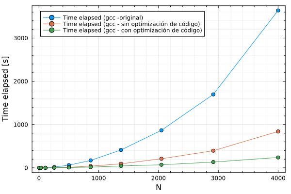
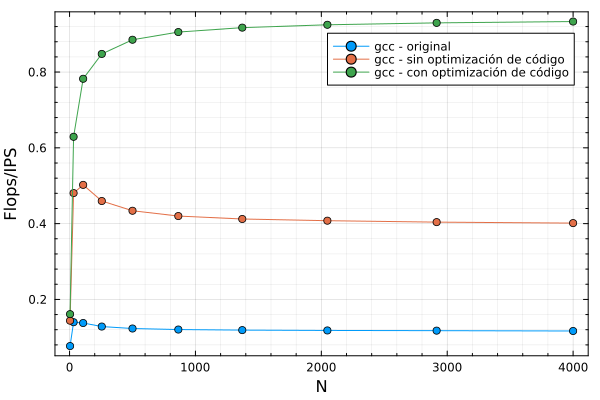

## Lab1

### Presentacion 

Puede encontrar la presentacion de las optimizaciones en [Google Slides Lab1](https://docs.google.com/presentation/d/1jwmwyytPebCFd45pzFj3KYWZ93sEZNNsB7zGjPXYmAQ/edit?usp=sharing)

### Resumen

Previo a un analisis del codigo, notamos que la funcion **forces** consumia un 96% del tiempo ejecucion. Por lo que si queriamos mejorar el rendimiento debiamos optimizar dicha funcion. 
Debido a la estructura del codigo de las funciones  **forces** y **minimum_image** en [core.c](core.c), fueron facilmente traducidas a AVX usando *intrinsics*.
Dicha modificacion tuvo grandes mejoras en el rendimiento del programa 

