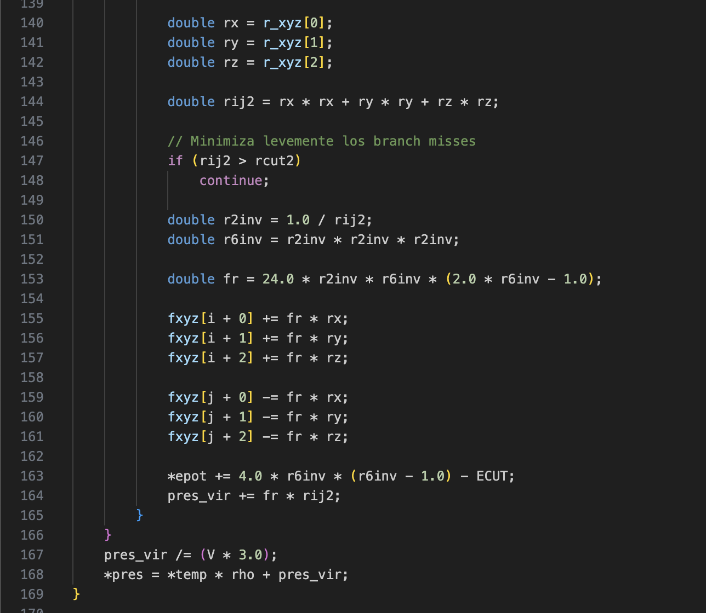
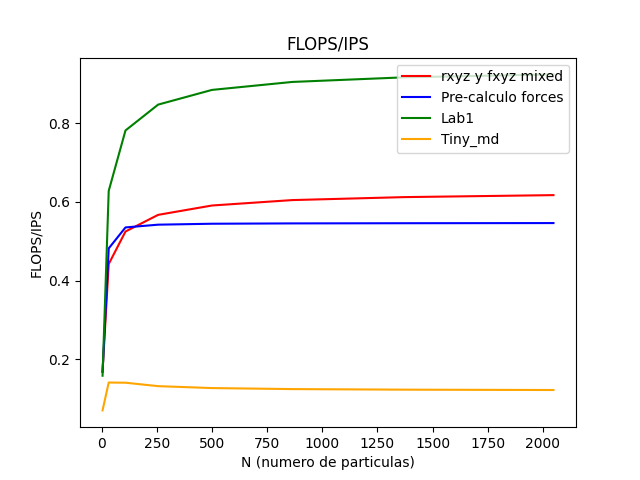
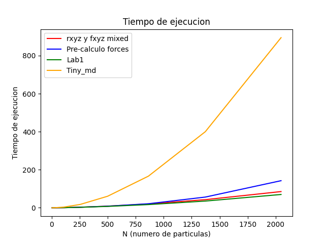

## Lab2

### Presentacion 

Puede encontrar la presentacion de las optimizaciones en [Google Slides Lab1]()

### Resumen

La base de este laboratorio es [Lab1](../lab1/). En este laboratorio se intento varias cosas de las cuales se puede destacar:
1. Traducir mas funciones usando AVX usando *intrinsics*
2. Cambiando la estructura de datos
3. Separar la funcion **forces** en dos, devido a un cuello de botella por AVX

- La primer opcion no genero muchos cambios en el rendimiento del programa debido a que el cuello de botella sigue sindo la funcion **forces**, mas especificamente la siguiente parte del codigo, la cual el compilador no genera un buen codigo AVX, ni tampoco hay una forma de hacerlo manualmente debido a la dependencia de datos

- La segunda opcion puede encontrarse en la carpeta [new-struct](new-struct/). La idea de este intento de optimizacion es que en **forces** solo accede a los vectores $rxyz$ y $fxyz$, con accesos lineales. Intentnado utilizar esto mezclamos los dos arreglos en uno solo en el cual estan intercalados los elementos de tal forma que mejore los accesos a memoria y pueda aprovechar mas la cache. Para poder indexar dichos arreglos hay que usar las funciones $gr$ y $gf$. 
En esta optimizacion si hubo una mejora pero solo para los valores de $N$ bajos, ya que para valores mas grandes el programa obligadamente debe ir a RAM, ademas dicho uso de funciones generan mas instrucciones, por lo que para $N$ mayores es peor que la version anterior

- La tercer opcion esta contruida sobre la segunda version y se puede encontrar en la carpeta [split forces](split-forces/). Esta idea se base en dividir **forces** en dos funciones. Para que en la primer funcion poder sacar lo mejor de AVX haciendo pre-calculos, para que en la segunda funcion evirar el uso AVX dado que no es conveniente por la estructura del codigo y las depedencias de datos. Esto tuvo un peor rendimiento por todas las instrucciones extras que se necesitan para que esto funcione. Sin contar la memoria adicional que hace falta usar para almacenar los pre-calculos.

